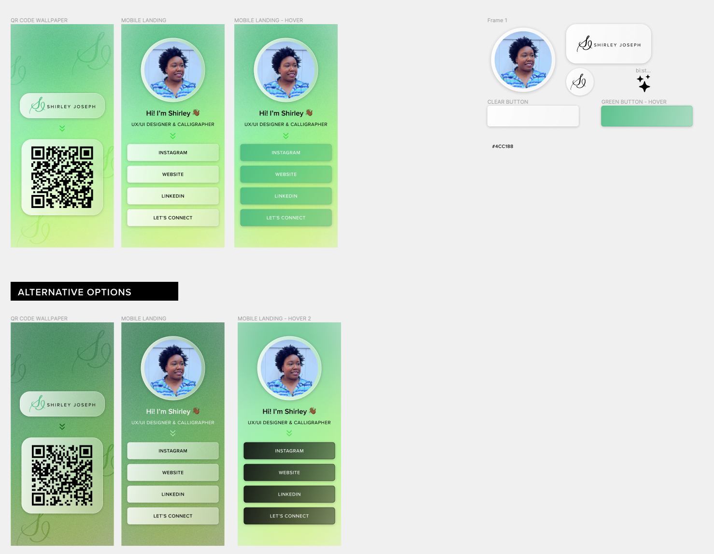
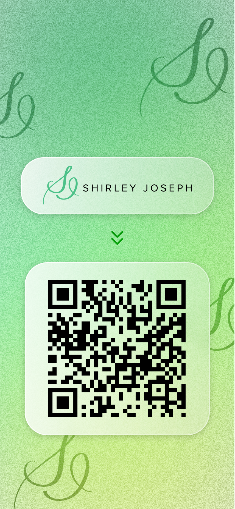
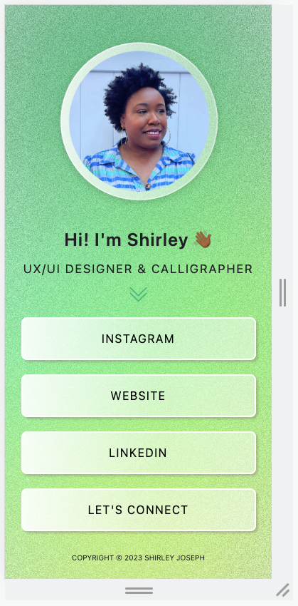

# Qr Code Wallpaper
A simple virtual business card activated by a qr code from your locked screen

** FOR MOBILE **

Design by UX/UI designer [Shirley Joseph](https://www.instagram.com/thatssoshirley/)

## Technologies Used
* HTML
* CSS
* [Bootstrap Icons](https://icons.getbootstrap.com/)
* [Pinterest](https://www.pinterest.com/)
* [Invisionapp](https://www.invisionapp.com/)
* [Figma](https://www.figma.com/files/recent?fuid=979381893432674988)

## Screenshots
### Design Brainstorm

### Working locked screen & landing page

## getting started
* [Click here](hhttps://qrcode-wallpaper.netlify.app/) for landing page.